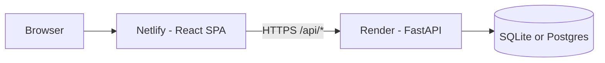

# PlotCRM — Deployment Guide

PlotCRM is split into two parts:

| Part | Stack | Host (recommended) |
|------|--------|---------------------|
| **Frontend** | React + Vite | [Netlify](https://netlify.com) (free) |
| **Backend** | FastAPI + SQLite/Postgres | [Render](https://render.com) (free) or Docker |

---

## Before you deploy

1. Push the project to **GitHub** (both Netlify and Render deploy from Git).
2. Generate a strong JWT secret (do not use the example key in production):
   ```bash
   python -c "import secrets; print(secrets.token_hex(32))"
   ```
3. Get a [Groq API key](https://console.groq.com/keys) if you want AI features.

---

## 1. Deploy the backend (Render)

### Option A — Blueprint (easiest)

1. Go to [Render Dashboard](https://dashboard.render.com) → **New** → **Blueprint**.
2. Connect your GitHub repo and select this project.
3. Render reads `render.yaml` and creates the **plotcrm-api** web service.
4. In the service **Environment** tab, set:

   | Variable | Value |
   |----------|--------|
   | `FRONTEND_URL` | Your Netlify URL (e.g. `https://plotcrm.netlify.app`) — set after step 2 |
   | `FRONTEND_BASE_URL` | Same as `FRONTEND_URL` |
   | `GROQ_API_KEY` | Your Groq key |
   | `JWT_SECRET_KEY` | Auto-generated by Blueprint, or paste your own |

5. Deploy. Note the service URL, e.g. `https://plotcrm-api.onrender.com`.

### Option B — Manual web service

1. **New** → **Web Service** → connect repo.
2. Settings:
   - **Root Directory**: *(leave empty — repo root)*
   - **Build Command**: `pip install -r requirements.txt`
   - **Start Command**: `uvicorn backend.main:app --host 0.0.0.0 --port $PORT`
   - **Health Check Path**: `/`
3. Add the same environment variables as above.
4. `DATABASE_URL` default: `sqlite:///./data/plotcrm.db` (data in `./data` on the instance).

### Verify backend

Open `https://YOUR-API.onrender.com/` — you should see JSON with `"status": "online"`.  
API docs: `https://YOUR-API.onrender.com/docs`

> **Free tier note:** Render spins down after inactivity; the first request may take ~30s. SQLite data and uploaded images can be lost on redeploy unless you add a [persistent disk](https://render.com/docs/disks) or use PostgreSQL + cloud storage.

### PostgreSQL (recommended for production)

1. On Render: **New** → **PostgreSQL** → create database.
2. Copy the **Internal Database URL** into the API service as `DATABASE_URL`.
3. Redeploy the API. No code changes needed (`psycopg2-binary` is in `requirements.txt`).

---

## 2. Deploy the frontend (Netlify)

1. Go to [Netlify](https://netlify.com) → **Add new site** → **Import an existing project** → connect your GitHub repo.
2. Configure settings:
   - **Base directory**: `frontend`
   - **Build command**: `npm run build`
   - **Publish directory**: `dist` (or `frontend/dist` if not setting Base directory)
3. **Environment variables**:
   Under Site configuration → Environment variables, add:

   | Name | Value |
   |------|--------|
   | `VITE_API_URL` | `https://YOUR-API.onrender.com` (no trailing slash) |

4. Deploy.

`frontend/netlify.toml` already configures the build and redirects all routes to `index.html` for React Router.

### After Netlify deploy

1. Copy your Netlify URL (e.g. `https://plotcrm.netlify.app`).
2. In **Render** → API service → **Environment**, set:
   - `FRONTEND_URL` = that URL
   - `FRONTEND_BASE_URL` = same URL
3. **Redeploy** the API so CORS allows your frontend.

### Local production build test

```bash
cd frontend
# Windows PowerShell:
$env:VITE_API_URL="https://YOUR-API.onrender.com"
npm run build
npm run preview
```

---

## 3. Docker (self-hosted / VPS)

From the project root:

```bash
docker compose up --build
```

API: `http://localhost:8000`  
Create `backend/.env` for secrets (`JWT_SECRET_KEY`, `GROQ_API_KEY`, etc.).

Build frontend separately and point `VITE_API_URL` at your server IP/domain, or serve `frontend/dist` with Nginx/Caddy.

---

## Environment variables reference

### Backend (`backend/.env` or Render)

| Variable | Required | Description |
|----------|----------|-------------|
| `JWT_SECRET_KEY` | Yes (prod) | Signs login tokens |
| `DATABASE_URL` | Yes | `sqlite:///./data/plotcrm.db` or Postgres URL |
| `FRONTEND_URL` | Yes (prod) | Netlify URL for CORS & QR links |
| `FRONTEND_BASE_URL` | Yes (prod) | Usually same as `FRONTEND_URL` |
| `GROQ_API_KEY` | For AI | Groq chat/search/brochure copy |
| `GEMINI_API_KEY` | Optional | AI fallback |
| `CORS_ORIGINS` | Optional | Extra origins, comma-separated |
| `PORT` | Render sets | Do not hardcode on Render |

### Frontend (Netlify)

| Variable | Required | Description |
|----------|----------|-------------|
| `VITE_API_URL` | Yes (prod) | Backend URL, e.g. `https://plotcrm-api.onrender.com` |

---

## Post-deploy checklist

- [ ] Sign up at `https://YOUR-APP.netlify.app/signup`
- [ ] Login works (no “Cannot reach server” toast)
- [ ] Create a plot and upload an image
- [ ] If AI fails, confirm `GROQ_API_KEY` on Render

---

## Troubleshooting

| Problem | Fix |
|---------|-----|
| Login fails / network error | Backend down or wrong `VITE_API_URL`. Check `https://YOUR-API/` returns JSON. |
| CORS error in browser console | Set `FRONTEND_URL` on Render to exact Netlify URL (https, no trailing slash) and redeploy API. |
| 404 on `/api/auth/me` after login | Stale token — clear site data / localStorage and log in again. |
| Uploads disappear | Use Render disk or Postgres; free SQLite is ephemeral on redeploy. |
| Slow first API call | Render free tier cold start — normal. |

---

## Architecture



---

## Quick commands (local dev)

```powershell
# Terminal 1 - API
cd "C:\path\to\REAL ESTATE PROJECT"
.\backend\venv\Scripts\python.exe -m uvicorn backend.main:app --host 127.0.0.1 --port 8000 --reload

# Terminal 2 - Frontend
cd frontend
npm run dev -- --host 127.0.0.1
```

Open: http://127.0.0.1:5173
